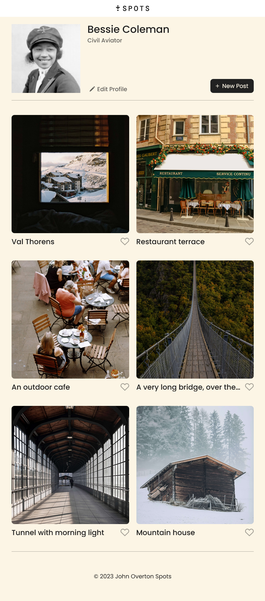
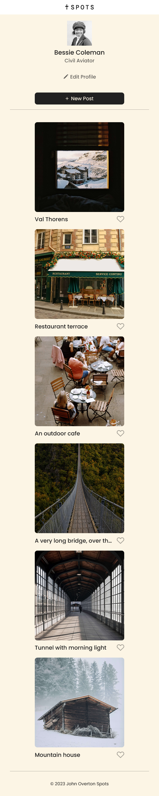
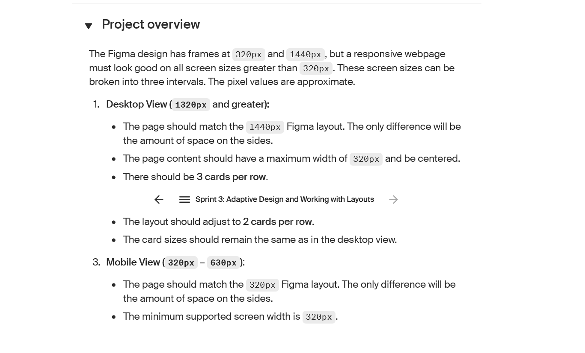
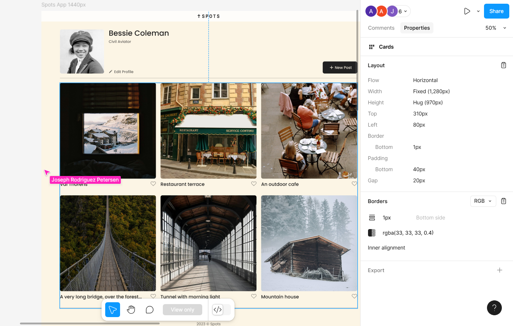
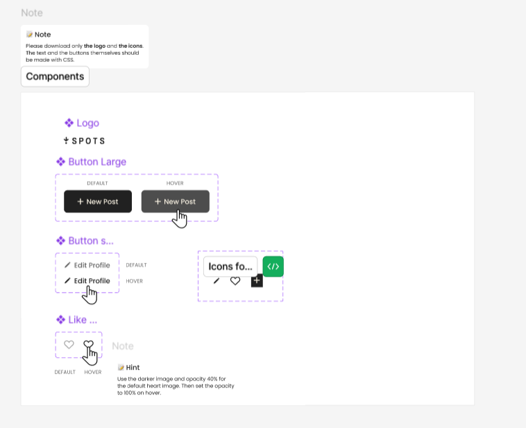

# Spots

## Project Overview

Spots is a responsive web project designed to help users discover, save, and share their favorite places. The application features a clean, modern interface for browsing locations, editing user profiles, and creating new posts. The layout adapts seamlessly to different screen sizes, ensuring a great experience on both desktop and mobile devices.

## Features

- Browse a gallery of beautiful places with images and names

## Features to come

- Like your favorite spots
- Edit your profile information
- Add new posts
- Fully responsive design for desktop, tablet, and mobile

## Technologies & Techniques Used

- **HTML5** for semantic markup
- **CSS3** (including Flexbox and CSS Grid) for layout and styling
- **Responsive design** with media queries for multiple screen sizes
- **Custom fonts** (Poppins)
- **Normalize.css** for cross-browser consistency
- **BEM Methodology** for css architecture

## Development Notes

- I have a new found enjoyment for responsive web design and utilzing modern css properties like grid and flexbox. It was fulfilling to drag the screen to and fro, changing the screen sizes and seeing the elements sizes and styles change fluidly. This is great web development foundation and I am thankful to Triple Ten for providing a professional workflow. Figma
  --> Property Extraction --> Code.

## Screenshots

Below are some screenshots showing the main features and responsive states of the project:

### Desktop Layout

### Two Column Layout

### One Column (Mobile) Layout

### Brief Overview

### Figma Design Reference

### Figma States

## Responsive Demo Video

https://user-images.githubusercontent.com/your-username/your-repo/main/images/readme/spots_responsive_video.mp4

Or view below (if supported):

<video src="images/readme/spots_responsive_video.mp4" controls width="600"></video>

## Figma Design

- [View the project on Figma](https://www.figma.com/file/BBNm2bC3lj8QQMHlnqRsga/Sprint-3-Project-%E2%80%94-Spots?type=design&node-id=2%3A60&mode=design&t=afgNFybdorZO6cQo-1)

## Live Site

- [View the live site on GitHub Pages at this URL](https://abelon22.github.io/se_project_spots/)
